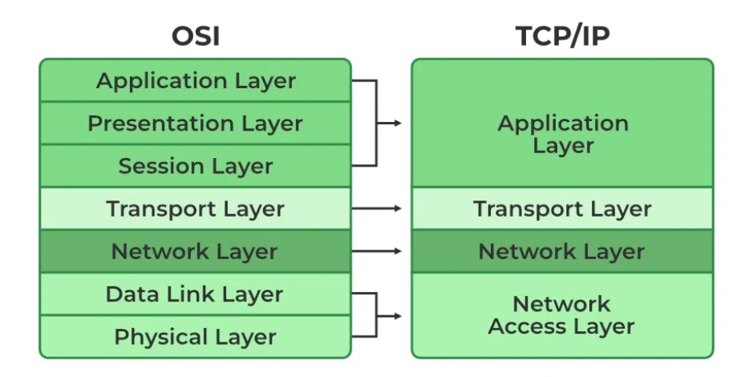

# What happens when you type www.google.com in a browser

- *In this article* we will try to understand how accessing a URL works
and what happens in the background.

## Introduction

Before we start this journey, it is important to understand some basic Networking concepts and terms, such as DNS, IP ..., we will cover that in the next chapter.

Another crucial note to take; this article aims to explain in detail (*Networking wise*) the process of visiting a site over the web. However,
this topic is very vast and encapsulates multiple layers of abstraction, we will leave some areas that way but try to explain in details other ones deemed necessary as an Introduction to this topic.
> [!NOTE]
> Whenever there is a major abstraction, I will include useful links for those who want to go deeper into the rabbit hole.

## Table of content

- [Introduction](#introduction)
- [Networking Glossary](#networking-glossary)
- [DNS](#dns)
- [TCP-IP](#tcp-ip)
- [Firewall](#firewall)
- [HTTPS-SSL](#https-ssl)
- [Load-Balancer](#load-balancer)
- [Web Server](#web-server)
- [Application Server](#application-server)
- [Database](#database)
- [Conclusion](#conclusion)

## Networking Glossary

Here, we will define some common terms that will be needed in your learning journey:

- **Connection**: This refers to a certain information exchanged (as laid out in a protocol) over a network, this comes before the data transfer.
- **Packet**: This is the smallest unit that is sent over a connection in a network, packets carry data in pieces (important concept of TCP),
  + A packet itself is divided into a header portion, with general information about it, and a payload, the actual piece of data also called body.
- Server: A server is a computer program or device that provides a service to another computer program and its user. (distinct from web-server)
- **Protocol**: A conventional set of rules and standards (usually laid out by experts) which define the language and framework that devices use to communicate. Many protocols exist varying in efficiency, security and other areas. (we will focus of TCP/IP).
- **URL**: Uniform Resource Locator, is a string of characters used to address a resource on the internet.
Here's a breakdown of a typical URL:
  + `protocol://domain-name-or-ip-address/path/to/resource?query_parameters#fragment_identifier
  `:

  | component  | meaning   | example   |
  |-------------- | -------------- | -------------- |
  | Protocol    | Indicates the communication protocol being used.     | HTTPS     |
  | DomainName or IP    | Identifies the location of the resource, either by domain name or by IP address    | www.google.com     |
  | Path    | Specifies the location of the specific resource on the server's filesystem.     | / (root)     |
  | Query Parameters     | Optional parameters that are appended to the URL and are typically used to pass information to the server.     | q=search_key     |
  | Fragment Identifier    |  Optional section that specifies a specific section or part of the resource being referenced     | section5      |

- [**HTTP**](https://www.cloudflare.com/learning/ddos/glossary/hypertext-transfer-protocol-http/): An application layer protocol used for accessing web-content.
  + Differing HTTP methods can be used on any endpoint which map to application create, read, update, and delete (CRUD) operations:

  | HTTP Method  | CRUD  | Description  |
  |-------------- | -------------- | -------------- |
  | GET    | Read    | Retrieve data from the server  |
  | POST or PATCH    | Create    | Send data to the server to create a new resource(record)  |
  | PUT    | Update    | Update data on the server  |
  | DELETE    | Delete    | Remove data from the server  |
 

## DNS

As you are typing a URL trying to access a web-site like shown above, considering some abstractions, the first thing to happen is the browser trying to figure what you just told it. Strings like the Url are for us humans who can't remember numbers such as an [IP address](https://en.wikipedia.org/wiki/IP_address).
Hence why the browser immediately seeks to *translate* the string you typed into an IP it can actually search for over the web.

The popular logical solution to this whole shebang; is know by a domain name system.

*A system set to resolve the domain name to an IP.*
- Usually, It sends a DNS request to a DNS resolver, which then queries authoritative DNS servers to find the IP address associated with the domain name. Once the IP address is obtained, your computer can establish a connection to the server hosting the website.

> [!NOTE]
> Your browser may try to resolve the domain name by looking in the appropriate cache, your go to web-sites might live there.

[*further reads*](https://www.cloudflare.com/learning/dns/what-is-dns/)

## TCP-IP

The [Transmission Control Protocol/Internet Protocol](https://www.fortinet.com/resources/cyberglossary/tcp-ip) (TCP/IP) model came before the [Open Systems Interconnection](https://www.fortinet.com/resources/cyberglossary/osi-model) (OSI) model, and it has five layers:

1. Application layer
2. Transport layer
3. Network access layer
4. Network interface layer
5. Hardware layer

| Layer              | Function                                                                           | Protocols/Examples                           |
|--------------------|-----------------------------------------------------------------------------------|---------------------------------------------|
| Application Layer  | Facilitates communication between applications and end-users.                    | HTTP, SMTP, FTP, DNS                        |
| Transport Layer    | Ensures reliable and efficient data transfer between devices.                     | TCP, UDP                                    |
| Networking Layer     | Handles routing of data packets between devices across interconnected networks.  | IP, ICMP, IGMP                               |
| Hardware Layer         | Deals with the physical transmission of data between devices on the same network. | Ethernet, Wi-Fi, PPP, DSL                   |

*This beautiful abstraction is what makes modern communication safe, fast, reliable and possible.*

In short:
> As the browser has the IP address in hand, it initiates a Transmission Control Protocol (TCP) connection from your computer to the server using the Internet Protocol (IP). TCP ensures reliable communication by breaking data into packets, sending them, and then reassembling them at the destination. This process ensures that the data reaches its destination intact and in the correct order.

## Firewall

Every good system functioning 
As the TCP connection is established, it may pass through various network devices, including firewalls. Firewalls monitor and control incoming and outgoing network traffic based on predetermined security rules. They act as a barrier between your computer and the internet, protecting against unauthorized access and malicious activity.

There are multiple types of firewall read more [here](https://en.wikipedia.org/wiki/Firewall_(computing)).
In this scenario, the type of firewall typically encountered is a **network firewall**.
- A network firewall is a security device or software application that monitors and controls incoming and outgoing network traffic based on predetermined security rules. It acts as a barrier between a trusted internal network and untrusted external networks (such as the internet). Network firewalls inspect packets of data passing through them and make decisions about whether to allow or block traffic based on criteria such as source and destination IP addresses, ports, and protocols.

## HTTPS-SSL

Remember HTTP, this is an anti-sniffer version, properly, a more secure version.

Using [auto-magic](https://medium.com/naukri-engineering/which-algorithm-to-choose-while-issuing-ordering-an-ssl-tls-certificate-b421ea6f7e38) encryption algorithms, we can abstract a cryptographic protocol *SSL (Secure Sockets Layer)* designed to provide secure communication over a computer network, typically the internet.

In today's digital age, security is a must. HTTPS ensures secure communication over the internet by encrypting data exchanged between your browser and the web server. When you type *https://www.google.com*, your browser initiates a secure connection using SSL/TLS protocols. This encryption protects sensitive information such as passwords, credit card details, and personal data from eavesdropping and tampering.

## Load-Balancer

Large websites like Google often employ multiple servers to handle incoming requests efficiently. A load balancer sits in front of these servers, distributing incoming traffic across them based on various factors such as server load, geographic location, and server health. This ensures optimal performance, scalability, and high availability of the website.

As you might predict again, the smart people already abstracted most the work for us, writing efficient and reliable algorithm to manage traffic redirection to the chosen server. This choice is made to match the developer's needs (based on the system design, traffic load, ...), from which is derived a specific load balancing algorithm.

| Algorithm                | Description                                                                                             | Example                                                   |
|--------------------------|---------------------------------------------------------------------------------------------------------|-----------------------------------------------------------|
| Round Robin              | Distributes incoming traffic evenly across backend servers in a circular order, regardless of server load. | Nginx, Apache, AWS Elastic Load Balancer (ELB)            |
| Least Connection         | Directs new connections to the server with the fewest active connections, aiming to balance load more evenly. | HAProxy, F5 BIG-IP, Citrix ADC                            |
| Weighted Round Robin     | Similar to Round Robin but allows assigning weights to servers, influencing the allocation of traffic based on capacity. | Nginx, Apache with mod_proxy_balancer, Google Cloud Load Balancing |

## Web Server

Once the request reaches the appropriate server, the web server processes it and retrieves the requested webpage or resources. In the case of https://www.google.com, Google's web servers generate the search results page dynamically based on the user's query and other parameters.

A [web server](https://en.wikipedia.org/wiki/Web_server) is software and hardware that uses HTTP and other protocols to respond to client requests made over the World Wide Web.

> [!NOTE]
> If your interested in playing with deploying static content and setting a secure connection to your web-server project, check the open source [HAproxy](https://www.haproxy.org) or [Nginx](https://www.haproxy.org) web-server and/or load-balancer. You will need [this](https://certbot.eff.org) as well, for a secure connection as mentioned previously.

## Application Server

In addition to serving static content like HTML, CSS, and images, many websites rely on application servers to handle dynamic content generation and business logic. These servers execute server-side scripts, interact with databases, and perform various computations before sending the final response to the client.

An [application server](https://en.wikipedia.org/wiki/Application_server) is a server that hosts applications or software that delivers a business application through a communication protocol. For a typical web application, the application server sits behind the web servers. An application server framework is a service layer model.

## Database

Behind every dynamic website lies a database where data is stored, retrieved, and manipulated. Application servers communicate with the database to fetch and update information dynamically. In the case of Google, its vast database contains indexed web pages, user preferences, search history, and other relevant data to deliver personalized and relevant search results.

A database is an organized collection of structured information, or data, typically stored electronically in a computer system. A database is usually controlled by a database management system (DBMS). Together, the data and the DBMS, along with the applications that are associated with them, are referred to as a database system, often shortened to just database.

A popular example is a [relational database](https://www.oracle.com/database/what-is-a-relational-database/).

| Database          | Description                                                                                          | Examples                                          |
|-------------------|------------------------------------------------------------------------------------------------------|---------------------------------------------------|
| Relational        | Organizes data into tables with rows and columns, using a structured query language (SQL) for data manipulation and retrieval. | MySQL, PostgreSQL, Microsoft SQL Server, Oracle  |
| NoSQL             | Emphasizes flexibility and scalability by storing data in non-tabular formats like key-value pairs, documents, or graphs. | MongoDB, Redis, Cassandra, Firebase Realtime DB   |
| In-Memory         | Stores data primarily in system memory rather than on disk, providing high-speed data access and low-latency performance. | Redis, Memcached, Hazelcast, Apache Ignite        |
| Document-Oriented| Stores data in flexible, semi-structured documents (e.g., JSON or BSON) instead of traditional rows and columns. | MongoDB, Couchbase, CouchDB, RavenDB               |

---

### Conclusion

The journey from typing https://www.google.com to seeing the search results page involves a series of intricate steps and abstractions, each performed by different components of the web stack. Understanding this process not only deepens our appreciation for the technology powering the internet but also equips us with valuable knowledge for troubleshooting and optimizing web applications. Next time you type a URL into your browser, remember the complex journey it takes to bring the web to your fingertips, or hackers to your important credentials.

I will leave you with this example of a web stack, using `python` for the app `HTML/CSS` as a code-base for static content, `MySQL` as database, `Nginx` as web-servers and `HAproxy` to handle Load-Balancer + HTTPS.

[LWSSIM](https://github.com/LWSSIM)
